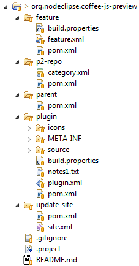

# CoffeeScript to JavaScript Preview

## Status

Alpha

## Getting

1. In Eclipse import Git project from https://github.com/Nodeclipse/org.nodeclipse.coffee-js-preview.git as General project.
2. Right-click the project, select Import -> Maven \ Existing Maven Projects

## Building

To build run `mvn package`

By default `mvn` tries to update all Eclipse repositories. 
For off-line usage add `<offline>false</offline>` to settings.xml or run with `-o` ,  `--offline` option.

## Acknowledgements

The code is based on [GFM Viewer plugin by satyagraha](https://github.com/satyagraha/gfm_viewer)
